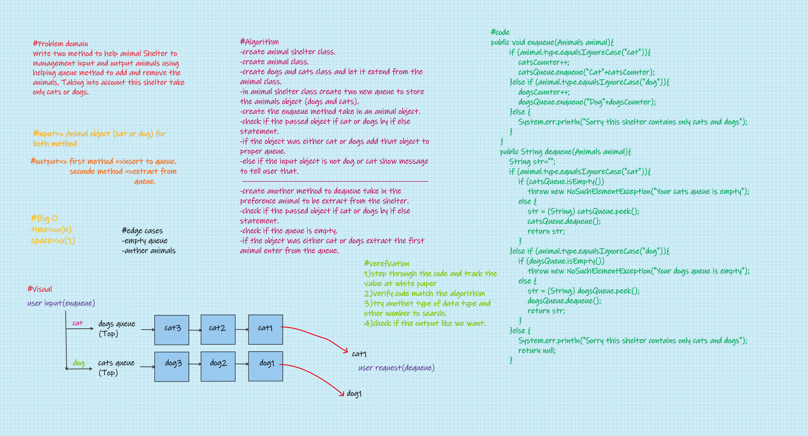

# Challenge Summary
#### Write function to help animal Shelter to management input and output animals using helping queue method to add and remove the animals, Taking into account this shelter take only cats or dogs.

## Whiteboard Process

## Approach & Efficiency
#### Creat, manage and control multiple classes and increase my knowledge in queue and how to deal with object, The big O I mention all this information in my whiteboard
## Solution
### - First go to main root and run gradle test you will see all my test is passed.
### - If you want to see and test my code go [here](../src/main/java/CodeChallenges/Challenge12/App.java) and run my code in intellij.