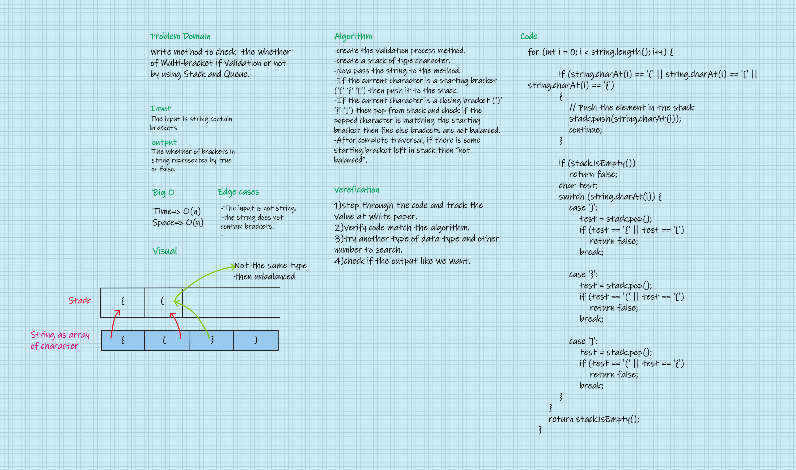

# Challenge Summary
Write method to check  the whether of Multi-bracket if balanced  or not by using Stack and Queue.
## Whiteboard Process

## Approach & Efficiency
#### In this Challenge I learned more about stack and queue and how to deal with it in case when we have to check the input string if balanced Multi-bracket or not by using switch statement in this challenge also. 

## Solution
### - To run my code go [here](../src/main/java/CodeChallenges/Challenge13/App.java) and see, test, run my code by your IDE.
### - To check the test unit go to the main root and run gradle test command.