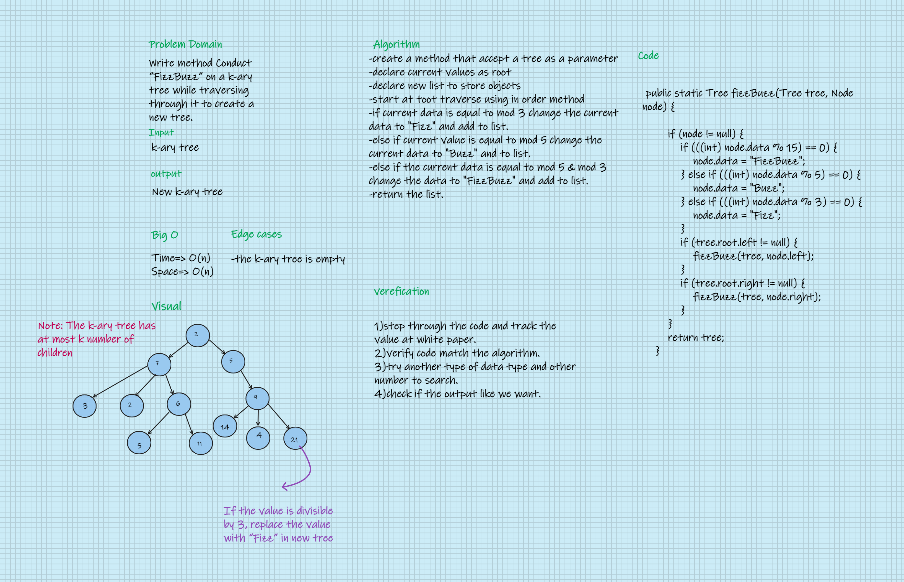

# Challenge Summary
Write method Conduct “FizzBuzz” on a k-ary tree while traversing through it to create a new tree.

## Whiteboard Process

## Approach & Efficiency
#### In this challenge I learned how to make a normal (k-ary) tree this tree can can contain k number of child to root node not like before we did were being binary tree that has only two chile allowed. also, I learned how to make function to convert the vlaue in the first tree to corresponding value in the other one. 

## Solution
#### Go [here](../src/main/java/CodeChallenges/Challenge18/FizzBuzzTree.java) and look at the code and test it.
#### this is screenshot to my success gradle test
