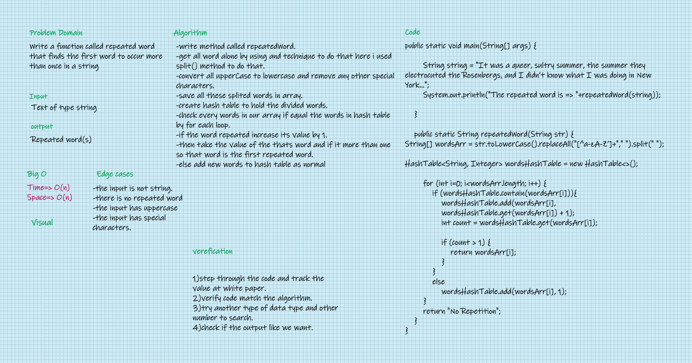

# Challenge Summary
#### Write a function called repeated word that finds the first word to occur more than once in a string.

## Whiteboard Process

## Approach & Efficiency
- Split the string and add each word in an array.
- Iterate through the array and convert the word to lower case, then check if the word has a special character then remove it.
- If the hashtable not contains the word add each word and the count of repeat it in hashtable, else return this word because that means the word is repeated.
- The Big O space O(n) / time is O(n).

## Solution
### Go [here](../src/main/java/CodeChallenges/Challenge31/App.java) and check my code and tun it in IDE.
