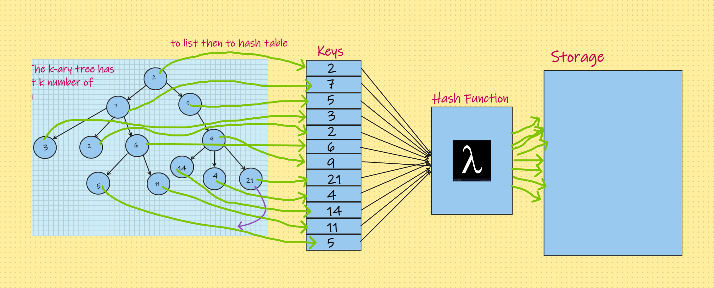

# Challenge Summary
#### Write a function called tree intersection that takes two binary trees as parameters and return a set of values found in both trees..
## Whiteboard Process

## Visualization

## Approach & Efficiency
- Do the different process on the tree like breadth and others.
- Insert the tree to hash table by specific process.
- Put the mechanism to compare two hash table to each other.
- The Big O space O(n) / time is O(n2).

## Solution
### Go [here](../src/main/java/CodeChallenges/Challenge32) and check my code and tun it in IDE.
