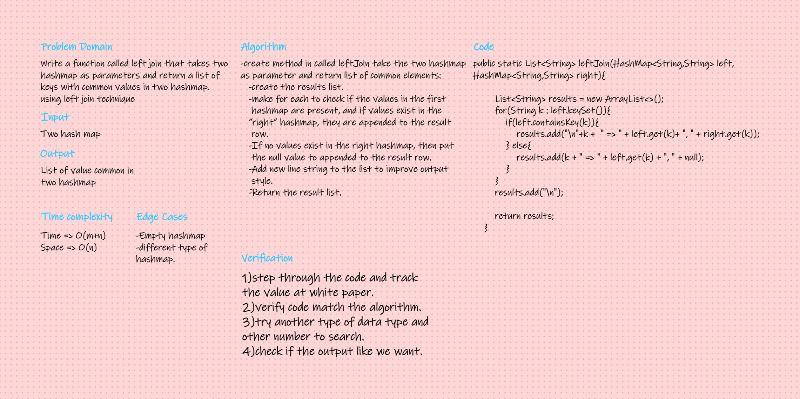

# Hashmap LEFT JOIN
#### The LEFT JOIN keyword returns all records from the left table (table1), and the matching records from the right table (table2). The result is 0 records from the right side, if there is no match.
## Challenge
#### Write a function that LEFT JOINs two hashmaps into a single data structure.

## Approach & Efficiency
#### Create a method that accepts 2 hash maps as a parameter. Declare a list and iterate through each hashmap and compare the keys if it matches. If each hash map has the same key, then add the key and values to the list, otherwise add to list with the second hash map value to null.

- Time O(m+n)
- Space	O(n)

## Solution
