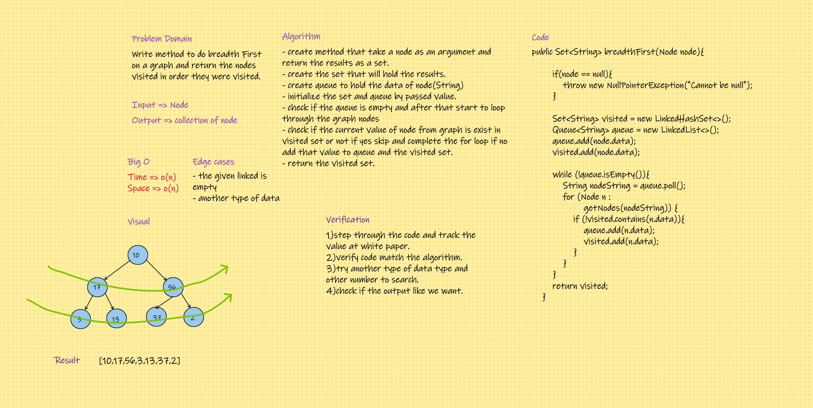

# Challenge Summary
#### Extend your graph object with a breadth-first traversal method that accepts a starting node. Without utilizing any of the built-in methods available to your language, return a collection of nodes in the order they were visited. Display the collection.

## Whiteboard Process

## Approach & Efficiency
#### Create a method that accepts a starting Node of a graph using a queue. The method returns a LinkedList of Nodes. The queue will add the children of the current node while the queue is not empty. The queue will eventually remove the nodes and add to LinkedList. Also, Using the Edge class, we check if the neighbor of the current node has been visited.

## Solution

#### Go to code [here](../../app/src/main/java/CodeChallenges/Challenge35_36)
#### Go to test [here](../../app/src/test/java/CodeChallenges/Challenge35_36/AppTest.java)
