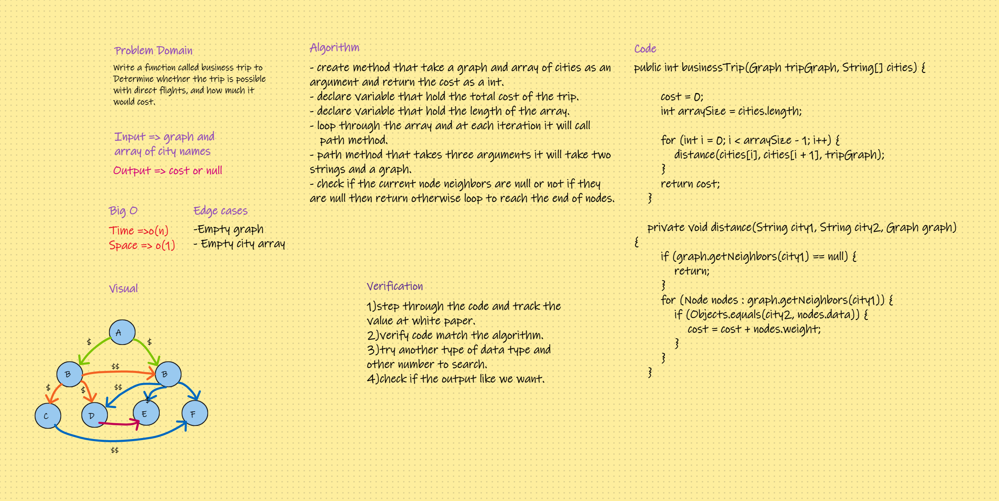

# Challenge Summary
#### Is a business trip with direct flights conceivable given a schedule and a route map? If so, what will the overall cost of the trip be?

## Whiteboard Process

## Approach & Efficiency
#### I learned how to use the graph data structure to implement function that responsible to determine the distance cost between the cities in the country.

## Solution
#### Go to code [here](../../app/src/main/java/CodeChallenges/Challenge35_36_37)
#### Go to test [here](../../app/src/test/java/CodeChallenges/Challenge35_36_37/AppTest.java)