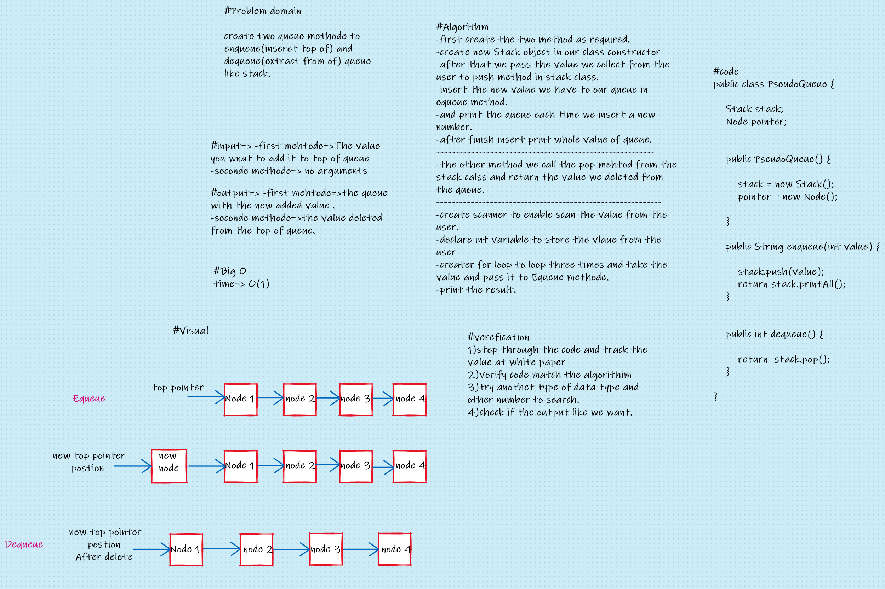

# Challenge Summary
#### Continue with the Stack and Queue by create new Pseudo class and generate two methode inside it, first method to add to top of queue using a first-in, first-out approach. by help of Stack class, and the second methode to remove from the top of queue and show the value deleted by using a first-in, first-out approach also.

## Whiteboard Process

## Approach & Efficiency
### In this challenge I have taken many thing, increase my information about Stack and Queue , and practice more about use class from another package and do more and more from test process. 
## Solution
### If you want to run and test my code follow this:
- To run my code go to this directory [here](src/main/java/CodeChallenges/Challenge11).
- To run my test go to this directory and run gradle test [here](../app).