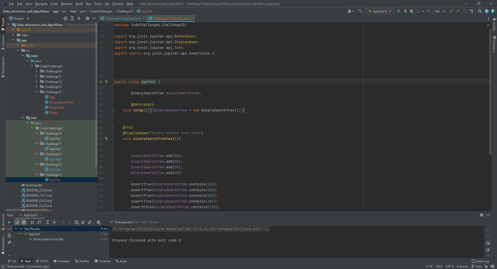

# Trees
Binary Tree is a special datastructures used for data storage purposes. A binary tree has a special condition that each node can have a maximum of two children. A binary tree has the benefits of both an ordered array and a linked list as search is as quick as in a sorted array and insertion or deletion operation are as fast as in linked list.

## Challenge
#### Write method represent the binary search by tree data structure, thats done by first create node class represent each node in the tree then create tree class to generate method enable us to see the tree, and I chose the preorder strategy after all that I have to create two method one to add value to the tree and the second to search about value in the tree.

## Approach & Efficiency
#### First create node class and then create binary tree class after that generate the binary search class that extends from the binary tree the way of show the tree.
- #### Searching: For searching element 1, we have to traverse elements (in order 5, 4, 1) = 3 = log2n. Therefore, searching in AVL tree has worst case complexity of O(log2n).
- #### Insertion: For inserting element 12, it must be inserted as right child of 9. Therefore, we need to traverse elements (in order 5, 7, 9) to insert 12 which has worst case complexity of O(log2n).
## API
<!-- Description of each method publicly available in each of your trees -->
#### In this code I used three methode 
- preOrder => To print out all tree elements.
- Add => To add element to tree.
- Contains => To search about specific value inside the tree.

## My test process
#### I think there is problem in last gradle test, so this is my test for this challenge
