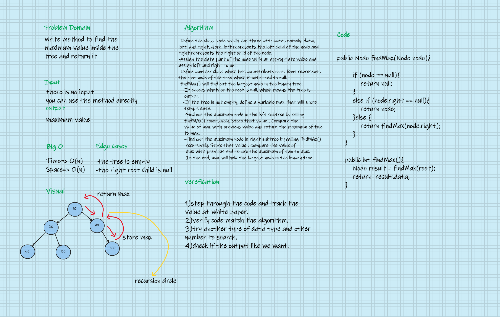

# Challenge Summary
#### Write method to find the maximum value inside the tree and return it.

## Whiteboard Process

## Approach & Efficiency
#### In Binary Search Tree, we can find maximum by traversing right pointers until we reach the rightmost node. But in Binary Tree, we must visit every node to figure out maximum. So the idea is to traverse the given tree.

## Solution
### Go [here](src/main/java/CodeChallenges/Challenge15_16) adn you can see my code and test it.
### About gradle test this my screenshot to see the result because I have a problem in previous tests.
