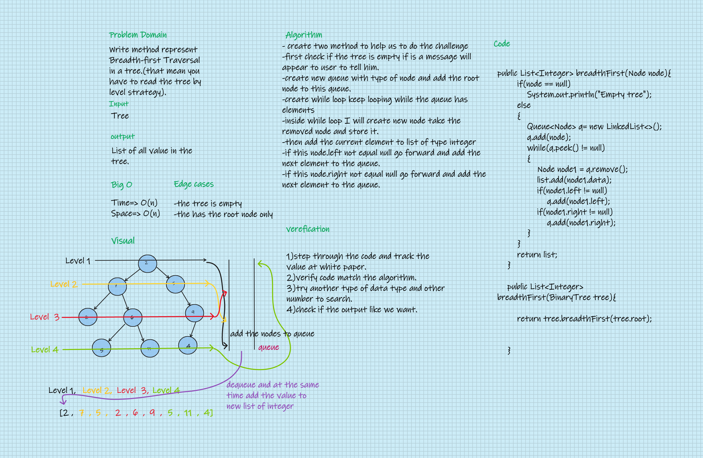
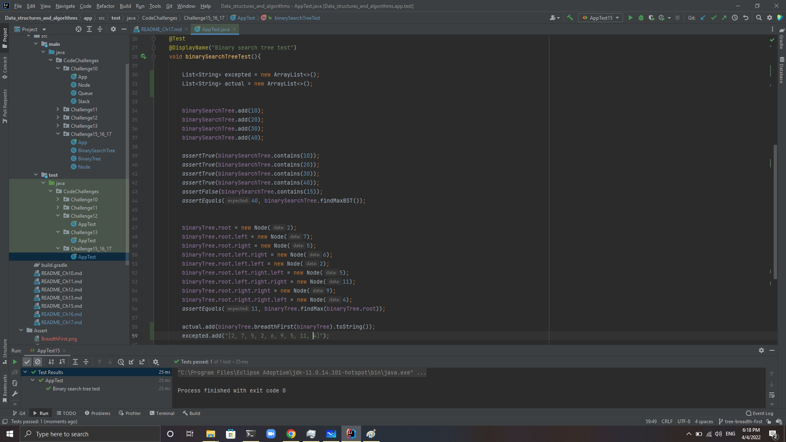

# Challenge Summary
Write method represent Breadth-first Traversal in a tree.(that mean you have to read the tree by level strategy).

## Whiteboard Process

## Approach & Efficiency
#### In this challenge I learned more about the tree and implementation more method that help us in tree data structure and how to link between the tree and queue.
#### 
## Solution
#### Go [here](src/main/java/CodeChallenges/Challenge15_16_17/BinaryTree.java) and look at the code and test it.
#### this is screenshot to my success gradle test
