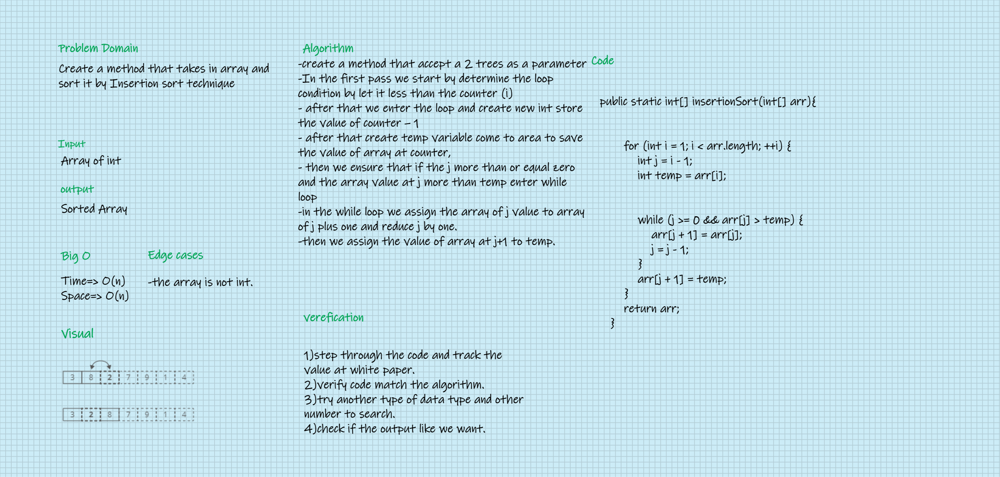

# Insertion Sort

# Challenge Summary
#### Review the pseudocode below, then trace the algorithm by stepping through the process with the provided sample array. Document my explanation by creating a blog article that shows the step-by-step output after each iteration through some sort of visual.

#### Once I'm done with your article, code a working, tested implementation of Insertion Sort based on the pseudocode provided.

## Whiteboard Process

## Approach & Efficiency
#### The approach I go is increase my skill to step over the algorithm step by step and recorde the result and make table contain the variables and its values at iterating moment

## Solution
### Go [here](src/main/java/CodeChallenges/Challenge26/App.java) and check my code and tun it in IDE,